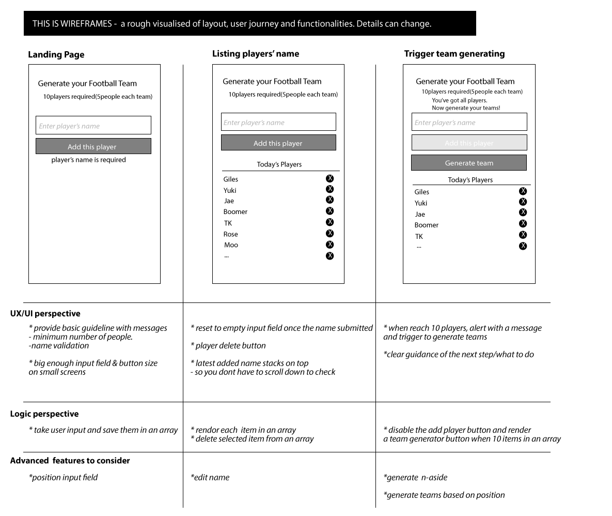
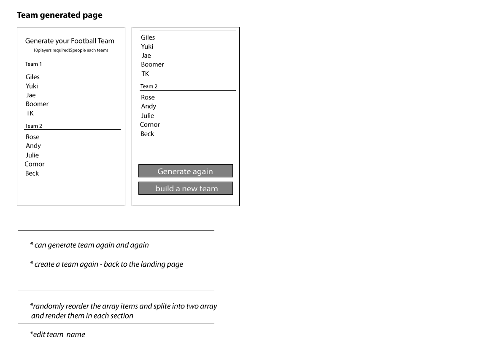
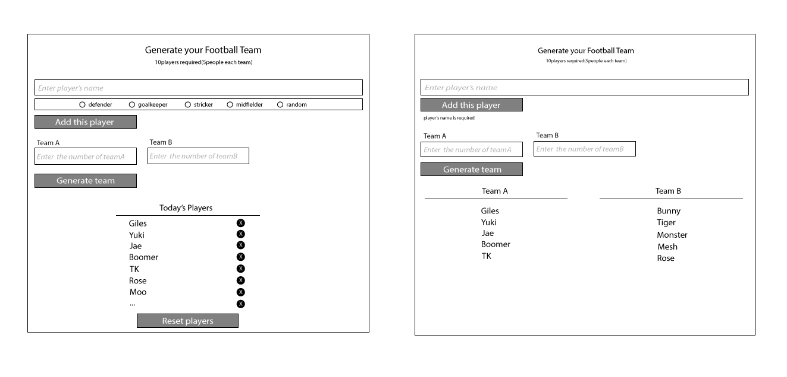
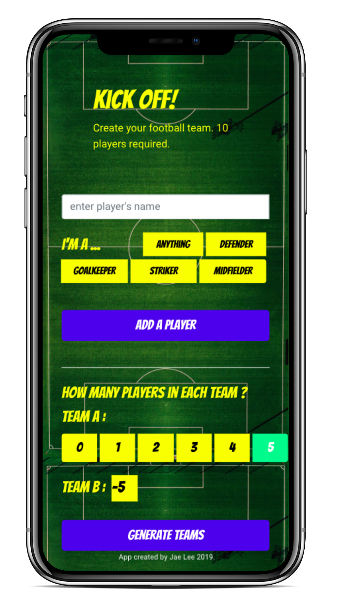
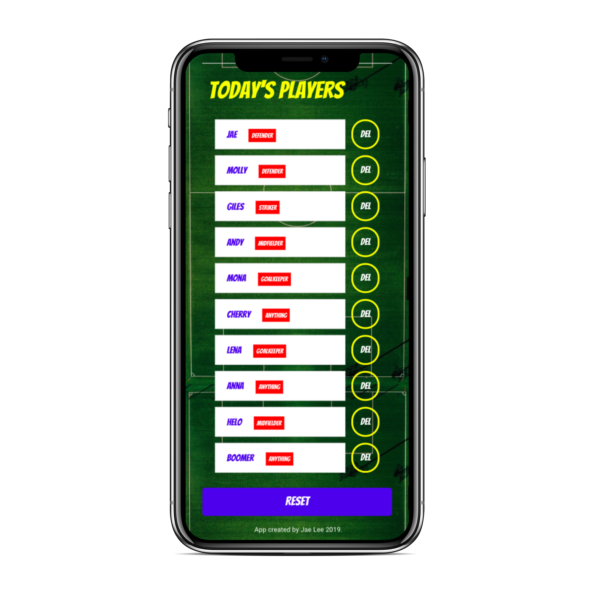
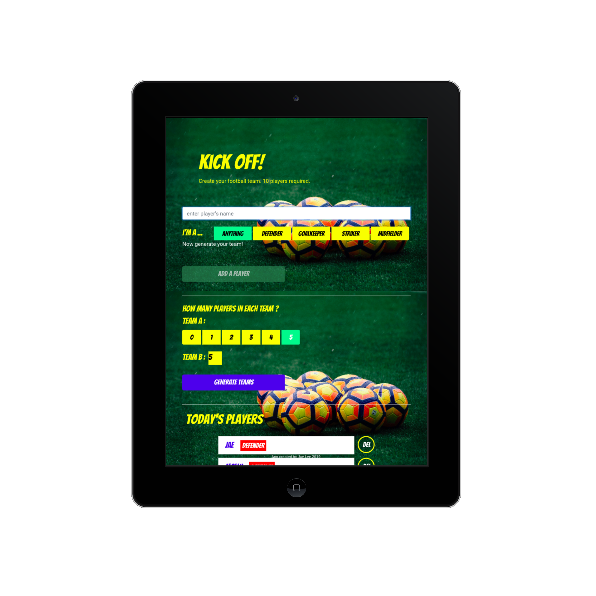
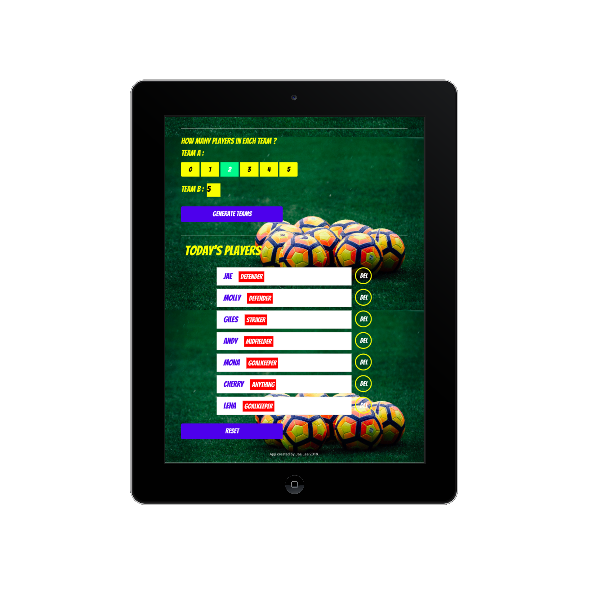
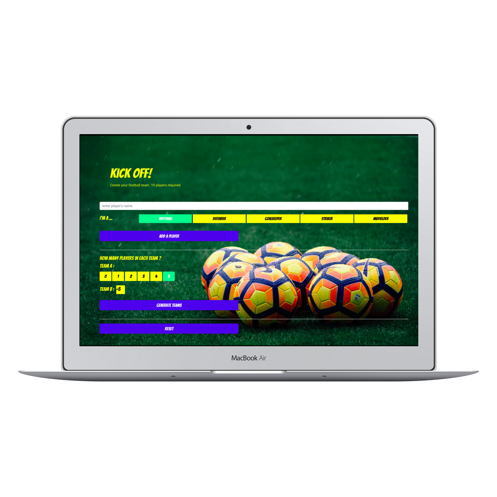
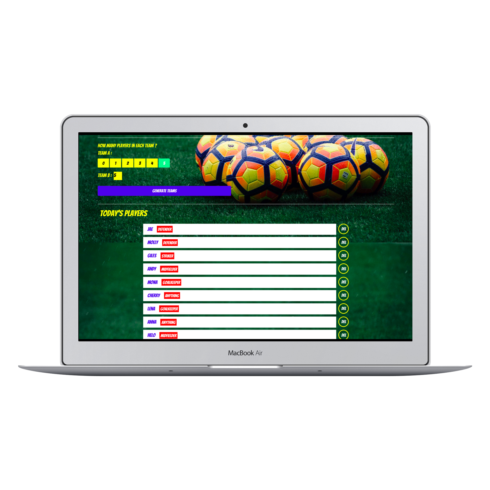
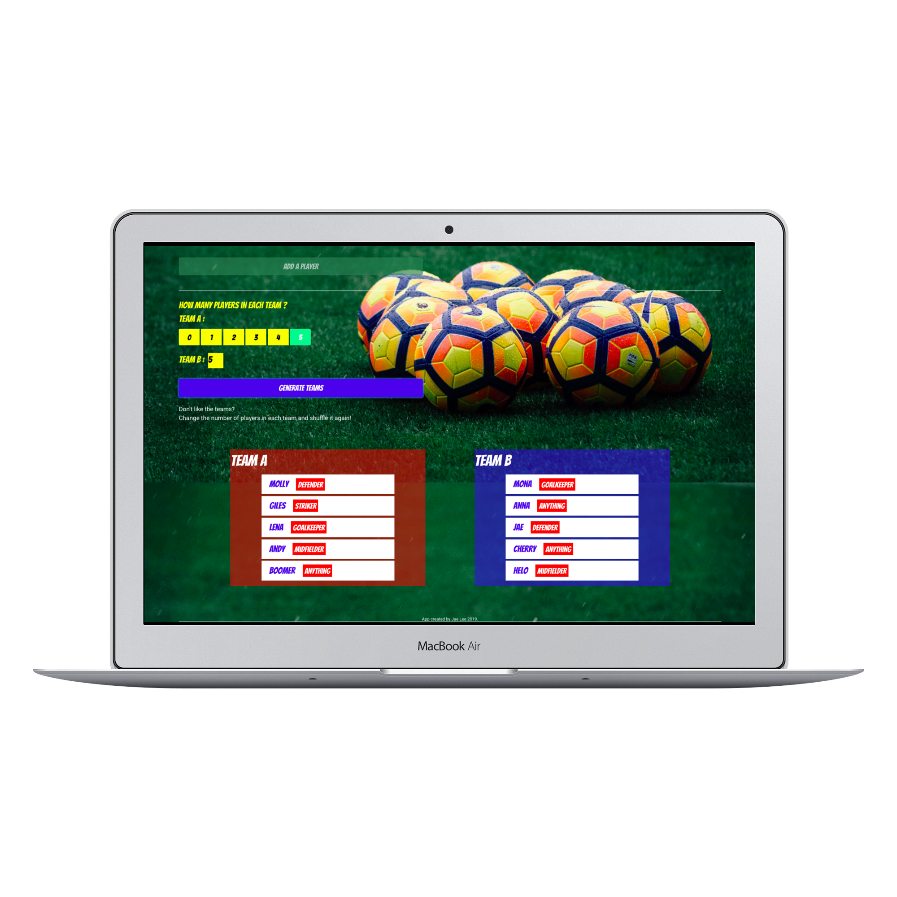

## KICK OFF! - your football-team-generator
A tool which randomly divide two n-a-side football teams from a list of 10 players.

## How to set up

1. NPM and a Command Line tool is needed.
2. git clone this repo and cd into the project folder
3. run npm install 
4. run npm start to view on localhost:3000 on browser

You can view the live app here: https://jaejae-lee.github.io/KickOff-football-team-generator/

## Technologies and skills used
React/Redux, JSX, JavaScript, HTML, CSS/SASS, Git, Wireframing.

## Initial ideation and planning
**MVP : Generate randomly picking a 5-a-side football team from a list of 10 names.<br/>
Advanced feature can be : user to pick n-a-side, user can pick a position(stricker, Defender, Mid-fielder, Goal-keeper..), divide teams by players' position**

* **Programming perspective:** 
MVP: Need to take user input -> store in an array -> divide into two arrays (push items in random order)
Advanced: Need to store as an object with key of player name and position into an array.
Limit the number of players on each position when user pick.
Each team need to has one of each position player.

* **UX perspective:**  don't confuss users of where to input information and what to do - provide clear and intuitive visual guidance and easy to use UI.

* **UI perspective:** Responsive design. Small screen(mobile/tablet) optimised design focus, as expecting a lot more use on them rather than desktop.

## Wireframes with notes





## Mockup - Small screen
<span style="display:inline;text-align:center">
    
</span>
<span style="display:inline;text-align:center">
    
</span>
<span style="display:inline;text-align:center">
    
</span>

## Mockup - Medium screen
<span style="display:inline;text-align:center">
    
</span>
<span style="display:inline;text-align:center">
    
</span>

##  Mockup - Large screen
<span style="display:inline;text-align:center;margin:0">
    
</span>
<span style="display:inline;text-align:center;margin:0">
    
</span>
<span style="display:inline;text-align:center;margin:0">
    
</span>


##  Testing
Google Dev Tools to check on it's performance with the full background image inserted
Mostly used google chrome with the use of redux dev tool. Testing on firefox and safari as well.

## What's next..
Once I managed to finish my MVP, I decided to add some advanced functionalities such as chosing positions and team size. But here's more I would like to try...

**Back-end data set up - build api :**

I'd be tempted to build an api with laravel and connect into the front-end.
would use one-to-many(each team has many players) relationship.

```
team A {
    "player_1" {
        player_name : "",
        position:"",
    },
    "player_2" {
        player_name : "",
        position: "",
    },
     "player_3" {
        player_name : "",
        position: "",
    }
}
```


**Front-end programming/styling update:**

* **More functionalities :** 
limit the number of position when user pick - only two players are allowed in each position.
divide teams based on the position - each team has one of each position.

* **Explore react hooks :**
I've come across about React hooks while I was researching. I didn't use in thie project as I focused on applying the logic I already practiced on the course. But always happy to explore new tools.

* **Explore react pre-built components :**
also come across react pre built components and seems like I can do lots of fun things with them ( ex. color picker - my favorite) which haven't got a chance to apply in this project yet. Look forward to exploring them.

* **Explore more Sass functions:**
brush up the current sass code with mixins, extends.
which I have't used in this app as I put a priority on better react/redux code then styling.


